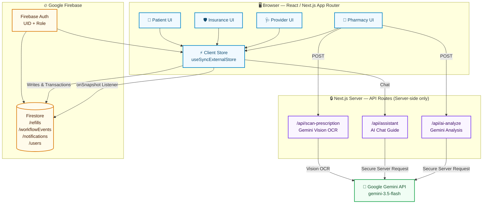
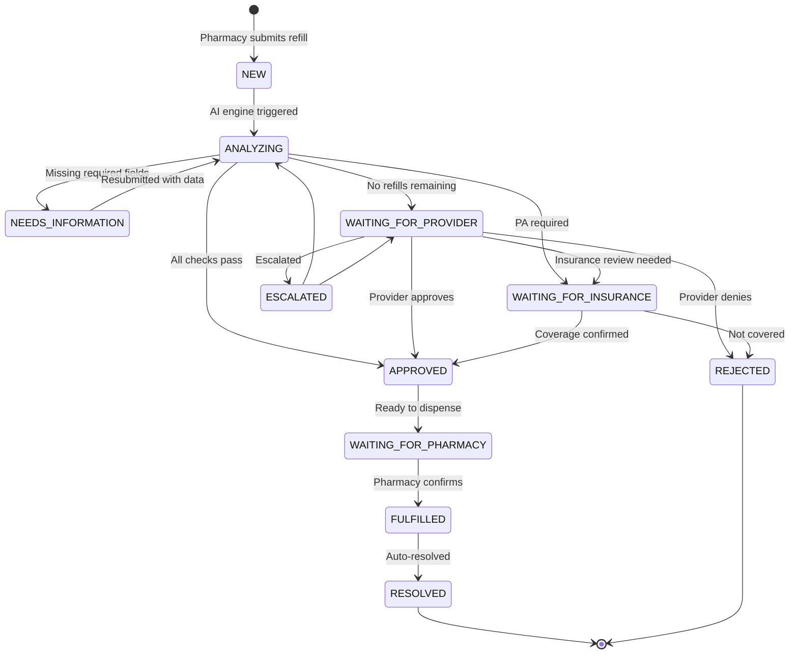
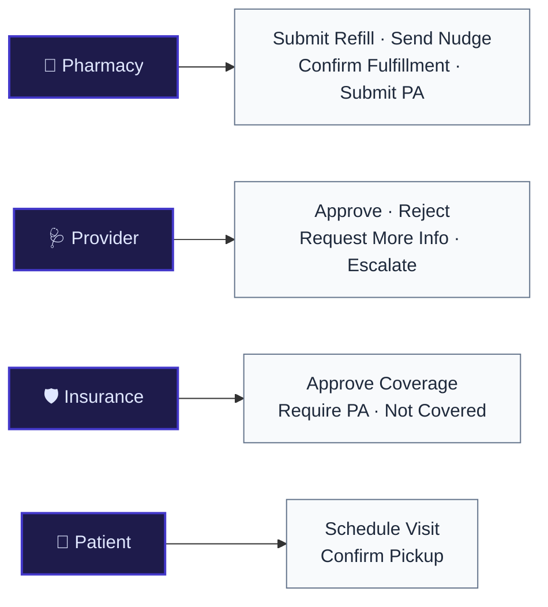
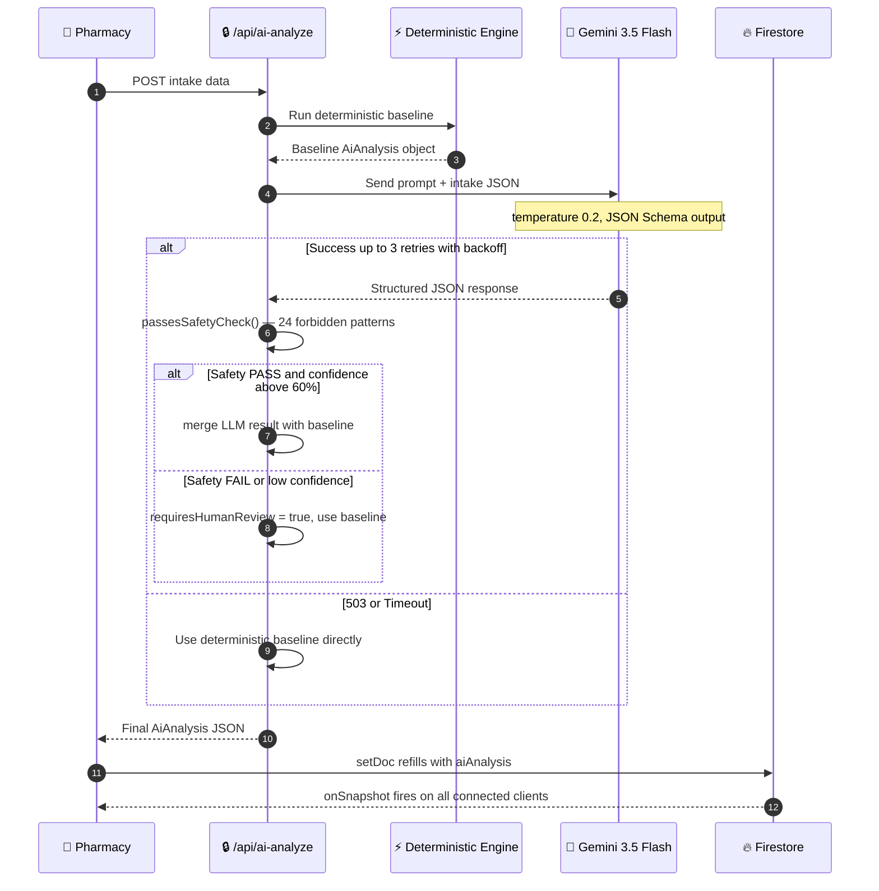
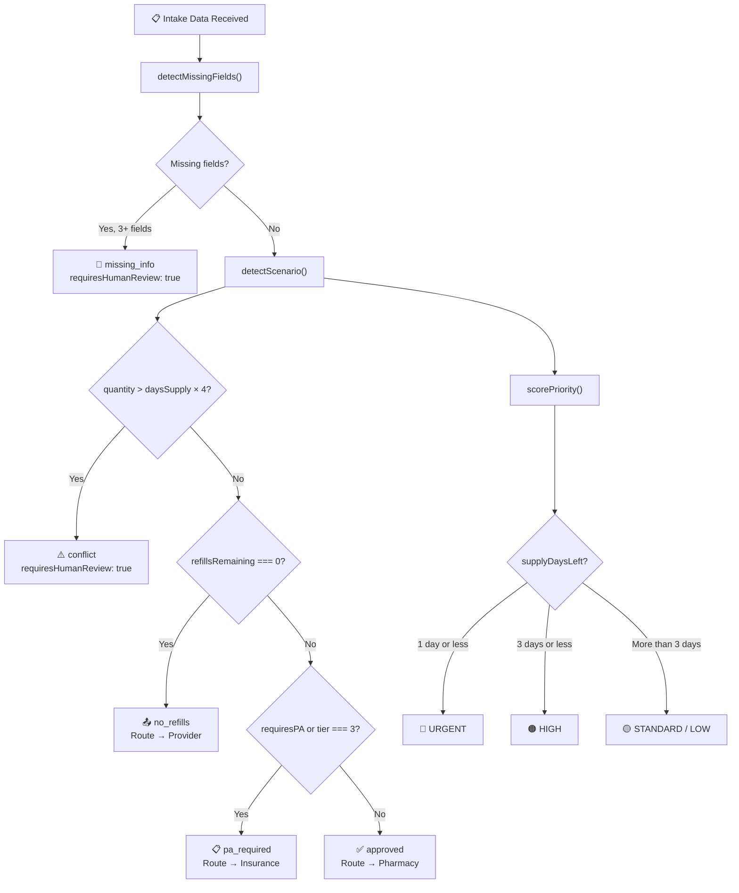
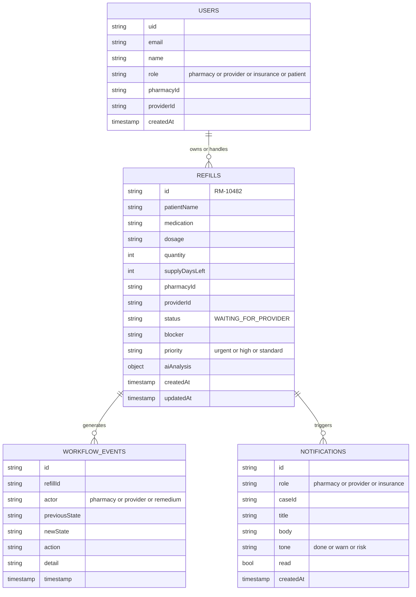
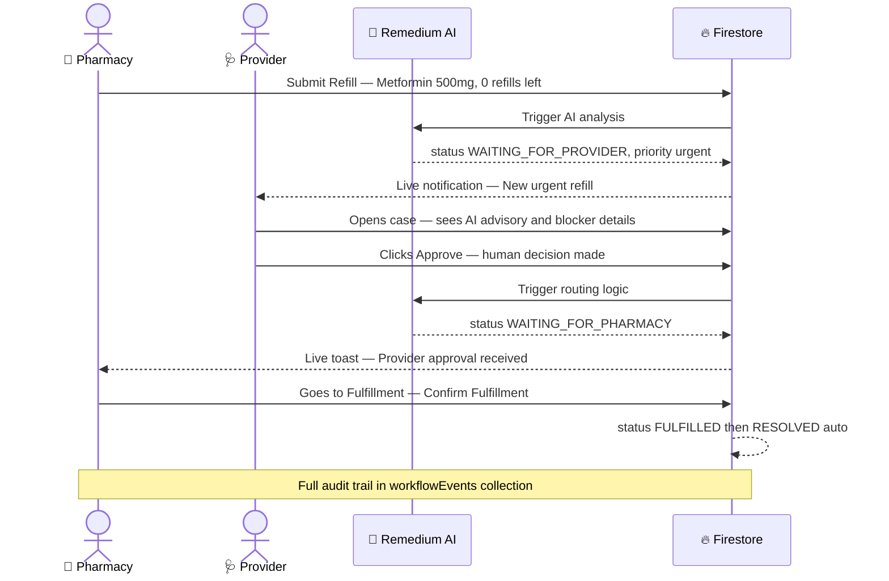

<div align="center">


# ✦ Remedium

### AI-Powered Prescription Refill Coordination Platform

*AI coordinates. Humans decide. Patients get their medication.*

<br/>

[](https://nextjs.org/)
[](https://www.typescriptlang.org/)
[](https://firebase.google.com/)
[](https://deepmind.google/technologies/gemini/)
[](https://tailwindcss.com/)
[](https://vercel.com/)

<br/>

> 🏥 **Hackathon Demo · September 2026**
> Built with Next.js 16, Firebase Firestore, Google Gemini AI, and TypeScript

</div>

---

## 🌐 What is Remedium?

Remedium is a **real-time prescription refill coordination platform** that unifies four disconnected stakeholders — pharmacies, providers, insurance, and patients — into a single intelligent workflow.

The US prescription refill system today relies on faxes, phone trees, and manual back-and-forth. Remedium eliminates that chaos: Google Gemini AI analyzes every refill, identifies the exact blocker, routes the case to the right person, and surfaces the recommended next action — while guaranteeing that every clinical decision is made by a **licensed human**, never by the AI.

---

## 😤 The Problem

```
           THE BROKEN PRESCRIPTION REFILL JOURNEY
  ┌──────────────────────────────────────────────────────────┐
  │                                                          │
  │  Patient needs refill                                    │
  │       ↓ (Day 1)                                          │
  │  Pharmacy calls provider office    ←— PHONE LOOP         │
  │       ↓ (Day 2)                                          │
  │  Provider requests PA from Insurance ←— FAX/EMAIL LOOP   │
  │       ↓ (Day 3-4)                                        │
  │  Insurance loses documentation     ←— INFO SILO          │
  │       ↓ (Day 5)                                          │
  │  Patient runs out of medication    ←— ADHERENCE FAILURE  │
  │                                                          │
  └──────────────────────────────────────────────────────────┘
```

| 🚨 Pain Point | 📉 Impact | 🩺 Real Cost |
|:---|:---|:---|
| 75% of refill denials need manual PA | 2–5 day delays | Lost patient outcomes |
| Pharmacists spend 30% of time on coordination | Staff burnout + overtime cost | $1.2B annually |
| No single system links all four parties | Information silos | Re-work and duplicate calls |
| AI tools auto-approve/reject prescriptions | Safety & liability risks | Regulatory exposure |
| Patients run out mid-treatment | Medication non-adherence | Preventable hospitalizations |

---

## ✅ The Solution

```
           THE REMEDIUM INTELLIGENT REFILL FLOW
  ┌──────────────────────────────────────────────────────────┐
  │  Patient needs refill                                    │
  │       ↓ (Instant)                                        │
  │  Pharmacy submits via Remedium                           │
  │       ↓ (<50ms)                                          │
  │  Gemini AI analyzes: blocker detected, PA pre-assembled  │
  │       ↓ (<500ms onSnapshot)                              │
  │  Provider sees case with AI advisory → One-click approve │
  │       ↓ (<500ms onSnapshot)                              │
  │  Pharmacy fulfills, patient gets medication              │
  │                                                          │
  │  ⏱ Total time: ~10 seconds end-to-end                   │
  └──────────────────────────────────────────────────────────┘
```

---

## 🏗 Architecture Overview



---

## ⚙️ Refill Workflow State Machine

Every refill is governed by a strict **finite state machine** in `workflow.ts`. All transitions are atomic Firestore transactions — invalid transitions throw and are **never committed**.



### State Transition Table

| From State | Valid Next States |
|:---|:---|
| `NEW` | `ANALYZING`, `CANCELLED` |
| `ANALYZING` | `NEEDS_INFORMATION`, `WAITING_FOR_PROVIDER`, `WAITING_FOR_INSURANCE`, `APPROVED`, `ESCALATED` |
| `WAITING_FOR_PROVIDER` | `APPROVED`, `WAITING_FOR_INSURANCE`, `NEEDS_INFORMATION`, `ESCALATED`, `REJECTED` |
| `WAITING_FOR_INSURANCE` | `APPROVED`, `WAITING_FOR_PROVIDER`, `NEEDS_INFORMATION`, `ESCALATED`, `REJECTED` |
| `APPROVED` | `WAITING_FOR_PHARMACY`, `ESCALATED` |
| `WAITING_FOR_PHARMACY` | `FULFILLED`, `ESCALATED` |
| `FULFILLED` | `RESOLVED`, `ESCALATED` |
| `ESCALATED` | `ANALYZING`, `WAITING_FOR_PROVIDER`, `APPROVED`, `CANCELLED`, `REJECTED` |
| `RESOLVED` / `REJECTED` / `CANCELLED` | *(terminal — no further transitions)* |

---

## 👥 Role System



---

## 🧠 AI Analysis Engine & Safety

### How AI Analysis Works



### AI Scenario Classification



### 🛡️ 5-Layer AI Safety Enforcement

> [!CAUTION]
> **The AI never makes clinical decisions.** Safety is enforced at five independent layers — compromising any single layer still leaves four others intact.

```
┌──────────────────────────────────────────────────────────────────────┐
│                     AI SAFETY ENFORCEMENT LAYERS                     │
├──────┬───────────────────────────────────────────────────────────────┤
│  L1  │ SYSTEM INSTRUCTION (Gemini API Level)                         │
│      │ "Never approve/reject prescriptions, change dosages,          │
│      │  or override insurance decisions."                            │
├──────┼───────────────────────────────────────────────────────────────┤
│  L2  │ PROMPT HARD RULES (buildPrompt injection)                     │
│      │ Explicit prohibition list embedded in every API request       │
├──────┼───────────────────────────────────────────────────────────────┤
│  L3  │ POST-GENERATION SCANNER (passesSafetyCheck)                   │
│      │ 24 forbidden pattern matches across all output fields         │
│      │ → On match: discard LLM output, return deterministic baseline │
├──────┼───────────────────────────────────────────────────────────────┤
│  L4  │ CONFIDENCE ESCALATION GATE                                    │
│      │ confidence < 0.60 OR missingFields >= 3                       │
│      │ → requiresHumanReview = true (cannot be suppressed by LLM)   │
├──────┼───────────────────────────────────────────────────────────────┤
│  L5  │ WORKFLOW STATE MACHINE + FIRESTORE SECURITY RULES             │
│      │ Only authenticated human UIDs can trigger state changes       │
└──────┴───────────────────────────────────────────────────────────────┘
```

| ✅ AI **CAN** | ❌ AI **CANNOT** |
|:---|:---|
| Recommend a next action | Execute that action |
| Flag a blocker | Remove the blocker autonomously |
| Draft a message | Send it without human review |
| Prioritize cases | Override human priority decisions |
| Detect missing prescription fields | Fill in clinical data |
| Explain why a case is stuck | Unstick the case autonomously |
| Suggest requesting a prior auth | Submit the PA (pharmacist must click) |

---

## 📂 Project Structure

```
remedium/
│
├── app/                            # Next.js App Router
│   ├── layout.tsx                  # Root layout + global state
│   ├── page.tsx                    # Marketing landing page
│   ├── api/
│   │   ├── ai-analyze/route.ts     # ← GEMINI_API_KEY lives here only
│   │   ├── assistant/route.ts      # Conversational AI guide
│   │   └── scan-prescription/      # Gemini Vision OCR
│   ├── login/
│   │   ├── page.tsx                # Role selection
│   │   └── [role]/page.tsx         # Auth form per role
│   └── app/
│       └── [role]/                 # Role-based workspace
│           ├── layout.tsx          # AppShell with auth context
│           ├── page.tsx            # Dashboard
│           └── cases/[id]/page.tsx # Refill case detail
│
├── components/
│   ├── app/
│   │   ├── app-shell.tsx           # AuthIdentityContext provider
│   │   ├── case-actions.tsx        # Approve/Reject/Escalate UI
│   │   ├── ai-analysis.tsx         # AI advisory card + draft editor
│   │   └── timeline.tsx            # Immutable audit trail
│   ├── auth/sign-in-form.tsx       # Multi-step auth flow
│   ├── marketing/                  # Landing page sections
│   └── remedium/
│       ├── global-robot.tsx        # Spline 3D robot + AI chatbot
│       └── primitives.tsx          # Shared design primitives
│
├── lib/remedium/
│   ├── types.ts                    # All TypeScript interfaces
│   ├── ai-engine.ts                # Deterministic analysis engine
│   ├── workflow.ts                 # Atomic state machine transitions
│   ├── firestore-service.ts        # All Firestore I/O functions
│   ├── store.ts                    # Client state (useSyncExternalStore)
│   └── seed.ts                     # 6 pre-configured demo scenarios
│
├── firestore.rules                 # Security enforcement
└── .env.local                      # Never committed
```

---

## 🔥 Firestore Data Model



---

## 🔌 API Routes

| Endpoint | Method | Purpose | Key Constraint |
|:---|:---|:---|:---|
| `/api/ai-analyze` | `POST` | Gemini LLM analysis for new refills | Server-side only, GEMINI_API_KEY never in browser |
| `/api/assistant` | `POST` | Conversational AI guide for users | Server-side only, graceful 200 fallback |
| `/api/scan-prescription` | `POST` | Gemini Vision OCR for image field extraction | Never auto-submits; pharmacist must confirm |

> [!IMPORTANT]
> `GEMINI_API_KEY` is **never bundled into the browser**. It only lives in server-side Route Handlers. If missing, routes return `503` and the deterministic engine runs as fallback — the workflow always completes.

---

## 🎭 Demo Scenarios

6 pre-configured synthetic refill scenarios cycle on each "Auto-fill Demo" click:

| # | Patient | Medication | Scenario | AI Route |
|:---:|:---|:---|:---|:---|
| 1 | John Doe `[DEMO]` | Metformin 500mg | No refills remaining | → Provider approval required |
| 2 | Maria Garcia `[DEMO]` | Ozempic 0.5mg | Prior auth required | → Insurance PA flow |
| 3 | James Wilson `[DEMO]` | Lisinopril 10mg | Missing prescription info | → Needs information |
| 4 | Eleanor Vance `[DEMO]` | Levothyroxine 50mcg | Normal 90-day supply | → Auto-approved |
| 5 | Robert Chen `[DEMO]` | Atorvastatin 20mg | Normal 30-day supply | → Auto-approved |
| 6 | Sarah Jenkins `[DEMO]` | Gabapentin 300mg | Dosage quantity conflict | → Human review escalated |

---

## 🚀 Getting Started

### 1. Configure Environment

```bash
cp .env.local.example .env.local
```

```env
# Firebase Client Keys (safe for browser)
NEXT_PUBLIC_FIREBASE_API_KEY=your_api_key
NEXT_PUBLIC_FIREBASE_AUTH_DOMAIN=your_project.firebaseapp.com
NEXT_PUBLIC_FIREBASE_PROJECT_ID=your_project_id
NEXT_PUBLIC_FIREBASE_STORAGE_BUCKET=your_project.appspot.com
NEXT_PUBLIC_FIREBASE_MESSAGING_SENDER_ID=123456789
NEXT_PUBLIC_FIREBASE_APP_ID=1:123456789:web:abc

# Gemini AI Key — SERVER-SIDE ONLY, never NEXT_PUBLIC_
GEMINI_API_KEY=your_gemini_key_here
```

### 2. Install & Run

```bash
pnpm install   # Install dependencies
pnpm dev       # Start dev server → http://localhost:3000
```

### 3. Demo Login

```
http://localhost:3000/login

→ Select Pharmacy → click "Demo" → auto-provisions demo.pharmacy@remedium.health
→ Select Provider → click "Demo" → auto-provisions demo.provider@remedium.health
```

### 4. Deploy

```bash
# Vercel (recommended)
vercel --prod
# Add GEMINI_API_KEY in Vercel Dashboard → Environment Variables

# Firebase security rules
firebase deploy --only firestore:rules
```

---

## 🔬 Complete Demo Flow (John Doe Scenario)



---

## ⏱️ Performance Benchmarks

| ⚡ Operation | ⏱ Typical Duration | Mechanism |
|:---|:---|:---|
| Deterministic AI fallback | `< 50ms` | In-memory evaluation, no network call |
| Firestore write | `~200ms` | Direct SDK write with transaction |
| `onSnapshot` cross-client update | `< 300ms` | Firestore WebSocket push to all subscribers |
| Gemini 3.5 Flash analysis | `1.2s – 2.8s` | Edge API Route → Gemini API |
| End-to-end refill resolution | `~10 seconds` | Human clicks + instant real-time sync |

---

## 🛠️ Tech Stack

| Layer | Technology | Version | Why |
|:---|:---|:---|:---|
| Framework | **Next.js** | 16.3.3 | App Router, API Routes, SSR |
| Language | **TypeScript** | 5.7.3 | Type safety across full-stack |
| Database | **Firebase Firestore** | 12.x | Real-time `onSnapshot`, atomic transactions |
| Auth | **Firebase Auth** | 12.x | Email/password + Google OAuth |
| AI / LLM | **Google Gemini** | 3.5-flash | Free tier, structured JSON output, fast |
| AI SDK | **@google/genai** | 2.24.0 | Official unified JS/TS SDK |
| Styling | **Tailwind CSS** | v4.3.3 | Custom design tokens, utility-first |
| 3D Robot | **@splinetool/react-spline** | 4.1.0 | Interactive 3D AI guide avatar |
| Icons | **Lucide React** | 1.16.0 | Consistent, accessible icon set |
| Package Manager | **pnpm** | 12.3.4 | Fast installs, workspace support |
| Hosting | **Vercel** | — | Edge-ready, zero-config deployment |

---

## 🔐 Security Notes

1. **`GEMINI_API_KEY` is server-side only** — no `NEXT_PUBLIC_` prefix; never in the browser bundle; never logged
2. **Firestore Security Rules** (`firestore.rules`) — only authenticated UIDs with the correct role can read/write
3. **AI cannot bypass the workflow** — `transition()` validates every state change atomically; invalid transitions throw and are never committed
4. **AI outputs are always advisory** — 5-layer safety enforcement prevents autonomous clinical decisions
5. **Demo data clearly labelled** — all demo patient names include `[DEMO]`; no real PHI is ever used
6. **`.env.local` is git-ignored** — API keys are never committed to source control

---

<div align="center">

<br/>

**Built with ❤️ for the 2026 Healthcare AI Hackathon**

*Remedium — Where AI coordinates, but humans always decide.*

</div>
